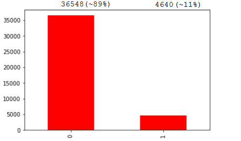
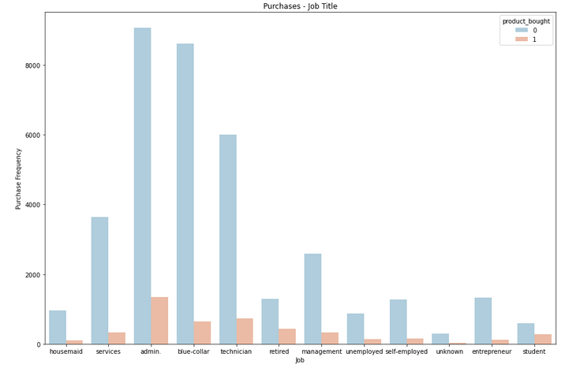
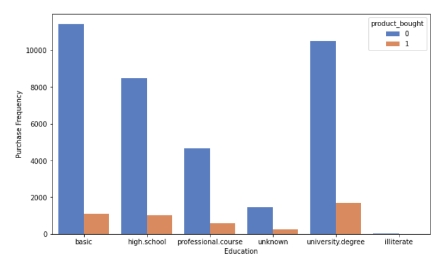
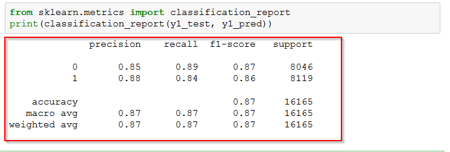

# Logistic Regression Model to analyze what kind of customers are most likely buying certain products

+ [Table of Contents](#sub-sub-heading-1)
    + [Credits](#credits)
    + [Project Goal and Procedure](#project-goal-and-procedure)
    + [Code and Resources](#code-and-resources)
    + [Part 1- Dataset Overview](#part-1--describing-the-dataset)
    + [Part 2- Data Insights](#part-2--data-insights)
    + [Part 3- Model Building](#part-3--model-building)
    + [Part 4- Deriving possible marketing strategies and conclusion](#part-4--deriving-possible-marketing-strategies-and-conclusion)

 ### Credits: 
 A big thank you goes to [KenJee](https://www.youtube.com/channel/UCiT9RITQ9PW6BhXK0y2jaeg), [Codebasics](https://www.youtube.com/channel/UCh9nVJoWXmFb7sLApWGcLPQ), [Krish Naik](https://www.youtube.com/user/krishnaik06), [Keith Galli](https://www.youtube.com/channel/UCq6XkhO5SZ66N04IcPbqNcw)  and to the whole [Edureka Team](https://www.youtube.com/user/edurekaIN) who put a lot of effort to teach people Data Science,Machine Learning, Statistics and a lot of other related topics for free.
 
 ### Project Goal and Procedure
 * Goal: Analyzing, based on different marketing campaigns, which customers are willing to buy certain banking products  
 * Algorithm: Logistic Regression
 * Using dataset from [Kaggle.com](https://www.kaggle.com/)
 * visualization of data using seaborn and matplotlib packages

 ### Code and Resources

* Python Version: 3.8
* Environment: Jupyter Notebook
* Packages: Pandas, Seaborn, Numpy, Scikit-learn, SMOTE, Sckit learn

## Part 1- Dataset Overview
The dataset, which was taken from Kaggle.com(https://www.kaggle.com/) is showing different information about the customers. The data was collected during marketing campaigns.
Now the bank wants to analyze the data to be able to predict customers behaviour when new products are offered. 

So the main question is: Who is the potential customer, who can I target? 

In total, the dataset contains more than 40.000 data from different customers. Among others, we have information about the age, the job, the marital status, education, possession of a house or not, having a loan or not and so on.
Totally, we have 20 independent variables (features) and one dependent variable (target), which is the fact if a customer has bought a certain product (yes/no). I you are interested in getting more information what each independent variable means, you can take a look in the Github repository where the descriptions are provided:

## Part 2- Data Insights
Data Visualization is always a good approach to get a better understanding of the data and its structure. 
The first plot shows a simple relation between the the number of people who bought a product and who did not. The result shows that 11% of the customers bought the product.

The next graph shows the frequency of purchase, based on the profession. The orange bar shows the people who did buy the product whereas the orange bar represents the customers who did not buy:

The same we can do for the Education colums (but also for all the other ones):

## Part 3- Model Building

Before the Logistic Regression Model can be built, it is necessary to transform all categorical variables to numeric ones. Python is not able to take text values as an input so we need to use the ,,One Hot Encoding"- method to make the data machine readable. 

In the next step it is important to balance the dataset because our data is obviously imbalanced (11% vs 89%- see above). Therefore, we can use the SMOTE-Technique (Synthetic Minority Oversampling Technique) which can be applied in oversampled datasets. 

Since we used the ,,One Hot Encoding" Technique, our number of columns increased. As we will probably not need all the columns to build a reliable model, we can make use of the Recursive Feature Elimination (RFE)- algorithm which helps us to identify the necessary features and remove the unneccessary ones. Afterwards we run the Logistic Regression Model from Scikit learn and printing out the results. 

## Part 4- Logistic Regression Results

After completing the mentioned steps, we can run the Logistic Regression Algorithm on our modified dataset. After cleaning, modifying and cleaning our initial data, it was possible to build a model with an accuracy score of 86,67%: 

The respective confusion matrix looks like this:

The confusion matrix is something like an error matrix to describe a performance of a model. 

In our scenario we have 7151 True Positive and 895 True Negative (Type I Error) values. 
Next, we have 1260 True Negative and 6859 False Negative (Type II Error) values.

After analyzing the confusion matrix, we can derive a classification report:

This is an overview how the precision, the recall and the f1- score are calculated:

